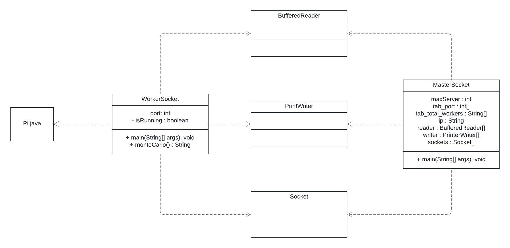

Tom Bogaert
INFI-3

<div align="center">

# Monte Carlo - Compte rendu

</div>

### **I - La méthode de Monte Carlo pour le calcul de π**

---

#### **Introduction**
La méthode Monte-Carlo, est une méthode algorithmique visant à calculer une valeur numérique approchée en utilisant des procédés aléatoires, c'est-à-dire des techniques probabilistes.
Ici, elle est appliquée au calcul de π de manière intuitive.

---

#### **Principe de la méthode**
La méthode repose sur une simulation géométrique :

1. **Contexte géométrique :**
   - Considérons un quart de cercle de rayon ( r ) inscrit dans un carré de côté ( r ), où r = 1.
   - La surface du quart de cercle est donnée par :  
     S_cercle = π * r² / 4 = **π / 4**.
   - La surface du carré est donnée par :  
     S_carré = r = 1.
   - Le rapport des surfaces est :  
     S_cercle / S_carré = π / 4.

##### Approche probabiliste :
- Si l'on génère des points aléatoires dans le carré, la proportion de points qui tombent dans le quart de cercle (n_cible) par rapport au total (n_tot) est une estimation de π / 4.
- On peut donc déduire π en multipliant ce rapport par 4.

La figure 1 ci-dessous illustre ce phénomène

---

### Algorithme
Le calcul de π par Monte Carlo suit ces étapes :

1. **Génération de points aléatoires :**  
   Générer N points aléatoires uniformément distribués dans le carré, dans l'intervalle [0, 1].

2. **Comptage des points dans le cercle :**  
   Vérifier pour chaque point (x, y) si :  
   x² + y² ≤ r².  
   Compter le nombre de points n_cible qui satisfont cette condition.

3. **Estimation de π :**  
   π ≈ 4 * (n_cible / n_tot).

#### Algorithme de Monte Carlo pour calculer pi
```
n_cible = 0
for p=0:n_tot-1:
    xp = Math.random();
    yp = Math.random();
    if (xp² + yp²) < 1 then
        n_cible ++;
    endif
endfor
pi = 4 * n_cible/n_for
```

#### Exemple numérique
1. Supposons n_tot = 10,000 points aléatoires.
2. Parmi ces points, n_cible = 7,850 tombent dans le cercle.
3. Alors :  
   π ≈ 4 * (7,850 / 10,000) = 3.14.

---

### Parallélisation avec la méthode Monte Carlo
Pour cela nous avons identifié deux tâches dans l'algorithme :
- T0 : Tirer et compter n_cible points

  *T0 peut se diviser en deux sous tâches :*
  - T0_1 : Tirer un point Xp
  - T0_2 : Incrémenter n_cible
- T1 : Calculer π

Nous avons ensuite identifié les ressources critiques, dans cette algorithme il n'y a qu'une seule ressource critique **n_cible**,
la section critique est donc l'incrémentation de n_cible : ``` n_cible ++; ```

La première méthode que j'ai pensé pour paralléliser le code, était d'utiliser le paradigme de programmation Master/Worker,
ou le nombre totale n_tot va être répartie équitablement entre chaque Worker.

Le pseudo code que j'avais proposé est le suivant :

```
master (nb_worker, nb_it):
    cpt = 0
    n_cible = [0]*nb_worker
    for no_worker = 0:nb_worker-1:
        n_cible[no_worker] = worker(nb_it/nb_worker).start()
    
    for no_worker = 0:nb_worker-1:
        cpt += n_cible[no_worker]
    pi = (cpt/it)*4
    return pi
    
worker (nb_it):
    cpt = 0
    for p = 0:nb_it-1:
        xp = Math.random()
        yp = Math.random()
        if (xp² + yp²) < 1:
            cpt += 1
    return cpt
```

On pouvait aussi utiliser le paradigme d'itération parrallèle/paralléisme de boucle, car chaque itération de boucle dans l'algorithme est indépendante. Que je vais plus détailler dans la suite du rapport à travers une de ses implémentations.

---

## **Analyse des codes sources implémentant la méthode de Monte Carlo pour calculer π**

### <u>Code 1 : Assignnment102</u>

Ce code implémentation directe de l'alogithme de Monte Carlo pour calculer pi, vu précédemment. Il utilise le paradigme de programmation  d'itération parrallèle en divisant chaque itération de la boucle en tâche à réaliser.

### ***Description des classes et des composants***

#### **1. Classe `PiMonteCarlo` :**
- **Rôle :** Effectue l'approximation de π en utilisant la méthode Monte Carlo avec parallélisme de boucle.
- **Attributs :**
    - `AtomicInteger nAtomSuccess` : Compteur atomique sécurisé pour stocker le nombre de points situés à l'intérieur du cercle. Équivalent à n_cible.
    - `int nThrows` : Nombre total de points aléatoires générés (ou "lancers"). Équivalent à n_tot.
    - `double value` : Contient la valeur approximée de π après calcul.
- **Méthodes :**
    - **Constructeur `PiMonteCarlo(int i)` :**
        - Initialise le compteur atomique, la valeur initiale de π à 0, et le nombre de lancers au nombre de lancer voulu.
    - **Classe interne `MonteCarlo` :**
        - Implémente `Runnable` pour permettre l'exécution en parallèle.
        - Génère des coordonnées aléatoires (x, y ∈ [0, 1]) et vérifie si le point tombe dans le cercle ((x^2 + y^2 < 1)).
        - Si le point est dans le cercle, incrémente `nAtomSuccess`.
    - **Méthode `getPi()` :**
        - Détecte le nombre de processeurs disponibles via `Runtime.getRuntime().availableProcessors()`.
        - Crée un pool de threads avec un `ExecutorService` utilisant une stratégie de *work-stealing*.
        - Programme `nThrows` tâches `MonteCarlo` pour exécution parallèle.
        - Attend la fin des calculs, puis calcule (π = 4 * (points dans le cercle) / (total de points)).

#### **2. Classe principale `Assignment102` :**
- **Rôle :** Exécute et mesure les performances du calcul.
- **Méthodes :**
    - **`main(String[] args)` :**
        - Crée une instance de `PiMonteCarlo` avec le nombre voulu de lancers.
        - Mesure la durée d'exécution avec `System.currentTimeMillis()`.
        - Appelle la méthode `getPi()` pour calculer π, puis affiche les résultats, y compris la différence avec la valeur réelle, l'erreur relative en pourcentage, le nombre de processeurs disponibles et le temps d'exécution.

---

### ***Points clés techniques***

1. **Parallélisme et exécution concurrente :**
    - Utilisation d'un `ExecutorService` avec un pool de threads optimisé pour le matériel disponible (*work-stealing pool*).
    - Les tâches sont définies dans une classe interne (`MonteCarlo`), et leur exécution est indépendante, permettant une distribution efficace sur plusieurs cœurs.


2. **Gestion sécurisée des données partagées :**
    - L'utilisation d'un `AtomicInteger` garantit que les incréments du compteur `nAtomSuccess` sont protéger contre les incohérences, c'est l'équivalent un moniteur sur un entier.


3. **Optimisation par détection du matériel :**
    - Le programme s'adapte au matériel disponible en détectant le nombre de processeurs via `Runtime.getRuntime().availableProcessors()`.

### ***Remarque***

**Approche Monte Carlo :**
- La méthode estime π en utilisant la proportion de points dans le cercle par rapport au nombre total de points générés. Cette méthode sera plus longue qu'une exécution séquentiel car le code n'est pas totalement parrallèle, au niveau de la section critique le code est exécuté séquentiellement car chaque thread doit attendre que la ressource soit libérer pour pouvoir l'incrémenter. Donc environ 75% des itérations sont bloqués à la section critique.
- Le moyen pour réduire cet impacte est de ne pas compter le nombre de point dans le cercle mais compter les point hors du cercle. Il n'y aura donc plus que 25% des itérations qui seront bloquées à la section critique. 

---

### <u>Code 2 : Pi.java</u>

Ce code implémentation le pseudo code que j'avais proposé précédement. Il utilise le paradigme de programmation  Master/Worker  ou le nombre totale d'itération va être répartie équitablement entre chaque Worker.

### ***Description des classes et des composants***

#### **1. Classe `Pi` :**
- **Rôle :** Point d’entrée du programme. Initialise le calcul parallèle pour approximer la valeur de π.
- **Méthodes :**
    - **`main(String[] args)` :**
        - Appelle la méthode `doRun()` de la classe `Master` avec le nombre itérations par travailleur et le nombre de travailleurs.
        - Affiche le résultat total des points dans le cercle.

#### **2. Classe `Master` :**
- **Rôle :** Coordonne l'exécution des calculs parallèles en déléguant des tâches aux instances de la classe `Worker`.
- **Méthodes :**
    - **`doRun(int totalCount, int numWorkers)` :**
        - **Création des tâches :**
            - Instancie un nombre donné (`numWorkers`) d'objets `Worker`, chacun avec un nombre d’itérations spécifique (`totalCount`).
            - Les tâches sont ajoutées à une liste `tasks`.
        - **Exécution parallèle :**
            - Crée un pool de threads fixe avec `Executors.newFixedThreadPool(numWorkers)` pour exécuter les tâches.
            - Exécute toutes les tâches avec `exec.invokeAll(tasks)` et récupère une liste de résultats (futures) du nombre de point dans le cercle.
        - **Agrégation des résultats :**
            - Parcourt chaque objet `Future<Long>` pour récupérer les résultats via `f.get()`.
            - Calcule (π = 4 * (points dans le cercle) / (total de points)).
        - **Affichage des performances :**
            - Affiche la valeur approximée de π, l’erreur relative, le nombre total de points, les threads utilisés, et la durée d’exécution.
        - Termine le pool avec `exec.shutdown()`.

#### **3. Classe `Worker` :**
- **Rôle :** Exécute individuellement une simulation Monte Carlo pour estimer le nombre de points dans le cercle.
- **Attributs :**
    - `int numIterations` : Nombre d’itérations que chaque travailleur doit traiter.
- **Méthodes :**
    - **Constructeur `Worker(int num)` :**
        - Initialise le nombre d’itérations à effectuer (préciser à leur instentiation dans Master).
    - **Méthode `call()` :**
        - Implémente l’interface `Callable<Long>` pour permettre la récupération des résultats.
        - Génère des coordonnées aléatoires (x, y ∈ [0, 1]) et vérifie si le point tombe dans le cercle (x^2 + y^2 < 1).
        - Si oui, incrémente un compteur local (circleCount qui est équivalent à n_cible pour un nombre d'itération numIterations).
        - Retourne le total de points dans le cercle.

---

### ***Points clés techniques***

1. **Utilisation des threads avec un pool fixe :**
    - Le programme utilise un pool de threads de taille fixe via `Executors.newFixedThreadPool(numWorkers)`, ce qui garantit un nombre limité de threads actifs. On remarque aussi que le nombre de thread est équivalent aux nombre de worker et aux nombre de tâches.
    - Un pool de threads gère et réutilise des threads pour exécuter des tâches en parallèle, optimisant l'utilisation des ressources système, réduisant les coûts de création et de destruction des threads, et limitant le nombre de threads actifs pour éviter la surcharge.


2. **Interface `Callable` et gestion des résultats :**
    - Chaque tâche est une instance de `Worker`, qui implémente `Callable<Long>` pour permettre le retour direct des résultats après exécution. Un Callable est l'équivalent d'un Runnable mais qui renvoie un résultat.
    - Les résultats sont encapsulés dans des objets `Future<Long>`, accessibles via `f.get()`, qui attendent la fin de l'exécution de chaque tâche. Un objet Future agit comme un conteneur pour le résultat du Callable.


3. **Équilibrage explicite des tâches :**
    - Chaque travailleur (`Worker`) effectue un nombre fixe d’itérations. L'équilibrage est explicite et basé sur une répartition initiale uniforme (nombre égal d’itérations par thread).


4. **Amélioration par agrégation des résultats :**
    - Contrairement à une approche utilisant un compteur partagé comme `AtomicInteger`, cette implémentation n’a pas de goulot d’étranglement dans une section critique. Chaque travailleur utilise un compteur local pour ses calculs.


5. **Système de synchronisation implicite :**
    - L’appel à `f.get()` agit comme une **barrière implicite**, empêchant l’agrégation des résultats tant que toutes les tâches ne sont pas terminées.

---

### ***Remarque***

1. **Parallélisme et efficacité :**
    - Chaque travailleur exécute ses tâches indépendamment, ce qui élimine les blocages associés à la gestion de données partagées.
    - Cette implémentation est plus performante que celle utilisant `AtomicInteger`, car les threads ne s’attendent pas mutuellement pour accéder à une section critique.


2. **Adaptabilité au matériel :**
    - La taille du pool de threads peut être ajustée pour correspondre au nombre de processeurs disponibles, optimisant l'utilisation des ressources matérielles.


3. **Synchronisation implicite :**
    - Bien que chaque thread travaille indépendamment, la méthode `invokeAll()` garantit que tous les threads terminent avant que les résultats ne soient agrégés. Cela simplifie la gestion de la concurrence.

---

A faire comparaison entre les deux

---

---

## Plan d'expérimentation :

### Code 1 :

nbProcessus ∈{1,2,4,8,16}

16 * nbItération ∈ {10^6,10^7,10^8,10^9}

erreur = ((π - estimation de pi)/ π )<= 10^-2

---
### Code 2 :

nbProcessus ∈{1,2,4,8,16}

16 * nbItération ∈ {10^6,10^7,10^8,10^9}

erreur = ((π - estimation de pi)/ π )<= 10^-2

---

Voici un **plan d'expérimentation sous forme de tableau** pour tester les performances des deux codes :

Dans cette étude, les paramètres de test et leurs valeurs ont été minutieusement sélectionnés pour évaluer les performances des programmes parallèles dans deux scénarios principaux : **scalabilité forte** et **scalabilité faible**. Chaque scénario permet d’explorer une facette différente de la parallélisation en jouant sur les relations entre **nombre de processus** et **charge de travail**.


| **Scénario**  | **Paramètre**               | **Valeurs possibles**                          | **Mesures à prendre**                             |
|---------------|-----------------------------|-----------------------------------------------|---------------------------------------------------|
| **1. Impact du nombre de processus** | **`nbProcessus`**             | {1, 2, 4, 8, 16}                | Temps d'exécution                |
|               | **`nbIterations`**           | 16*(10^7)                                      | Temps d'exécution                |
| **2. Impact du nombre d'itérations** | **`nbIterations`**           | {nbProcessus\*16x10^7, nbProcessus\*16x10^8, nbProcessus\*16x10^9}                      | Temps d'exécution                |
|               | **`nbProcessus`**            | {1, 2, 4, 8, 16}                                            | Temps d'exécution                |


### **Détails des mesures :**
- **Erreur relative :** ((π - estimation de pi)/ π ), avec un objectif d'erreur <= 10^-2.
- **Temps d'exécution :** Temps total nécessaire pour calculer l'approximation de pi.


### Justification des valeurs de test choisies

#### **1. Scénario 1 : Impact du nombre de processus (scalabilité forte)**

Dans ce scénario, nous maintenons constant le nombre total d'itérations (\(16 \times 10^7\)) et faisons varier le nombre de processus. L’objectif est d’analyser l’impact direct de la parallélisation sur une charge de travail fixe, ce qui permet d’évaluer la **scalabilité forte**.

**Pourquoi ces valeurs ?**
- **Nombre de processus** :
  - Nous avons choisi les valeurs \( \{ 1, 2, 4, 8, 16 \} \) car elles correspondent à des configurations courantes sur des systèmes multicœurs ou des clusters.  
  - Le test avec **1 processus** sert de référence pour mesurer les performances séquentielles et calculer le **speed-up**.
  - Les valeurs **2, 4, 8**, et **16 processus** permettent d'observer comment l'ajout progressif de ressources améliore (ou non) les performances.
  - La progression géométrique du nombre de processus (multiplié par 2) est choisie pour faciliter l'analyse du **speed-up** (gain théorique linéaire).

- **Nombre d’itérations (\(16 \times 10^7\))** :
  - La charge de travail est maintenue constante pour chaque test afin que l’augmentation du nombre de processus soit le seul facteur influençant le temps d'exécution. 
  - \(16 \times 10^7\) correspond à un volume de calcul suffisant pour saturer plusieurs cœurs, ce qui garantit des tests significatifs pour les systèmes parallèles.


#### **2. Scénario 2 : Impact du nombre d'itérations (scalabilité faible)**

Dans ce scénario, nous augmentons proportionnellement le nombre d'itérations avec le nombre de processus (\(nbProcessus \times 16 \times 10^7\)). L’objectif est d’évaluer la **scalabilité faible**, c’est-à-dire la capacité du programme à gérer une charge de travail croissante avec des ressources supplémentaires.

**Pourquoi ces valeurs ?**
- **Nombre d’itérations** :
  - La charge de travail est proportionnelle au nombre de processus. Cela simule des cas réalistes où chaque processus est responsable d’une part fixe de la charge totale, indépendamment du nombre total de processus.
  - Les valeurs \( nbProcessus \times 16 \times 10^7 \) et \( nbProcessus \times 16 \times 10^8 \) permettent de tester à la fois une charge modérée et une charge élevée, ce qui met en évidence les limitations du programme en cas de surcharge.

- **Nombre de processus (\(1, 2, 4, 8, 16\))** :
  - Comme dans le scénario précédent, ces valeurs progressent géométriquement pour permettre une analyse cohérente de l’efficacité.
  - La multiplication par le nombre de processus reflète une augmentation naturelle de la charge de travail, où chaque processus conserve un volume fixe de calcul.


---
---

### <u>Code 3 : javaSocket</u>

Conception :
1. MasterSocket.java (Le master) :
Le programme MasterSocket est un client qui se connecte à plusieurs serveurs (workers) pour distribuer les calculs nécessaires à l'estimation de π.

2. WorkerSocket.java (Le worker) :
Le programme WorkerSocket représente un worker qui écoute une connexion d'un client (Master) et effectue les calculs de Monte Carlo pour estimer la valeur de π.

Les programmes `MasterSocket` et `WorkerSocket` interagissent via des **sockets Java**, qui permettent l'échange de messages via des flux d'entrée et de sortie. Le programme **MasterSocket** agit en tant que client, établissant des connexions avec plusieurs serveurs (workers) via des **sockets** sur des ports spécifiques. Une fois les connexions établies, le master envoie le nombre de lancers à effectuer à chaque worker, répartissant ainsi la charge de calcul. Chaque worker, représenté par le programme **WorkerSocket**, écoute les connexions entrantes sur un port donné, accepte les connexions via un **`ServerSocket`**, puis reçoit les messages du master (nombre de lancers à effectuer) via un **BufferRead**. Les workers effectuent le calcul de Monte Carlo, en utilisant Pi.java. Les résultats sont ensuite envoyés au master via des **PrintWriter**, et le master combine les résultats pour obtenir une approximation finale de π. Une fois le calcul terminé, le master envoie un message "END" à chaque worker, signalant la fin de l'opération, et chaque worker ferme sa connexion.




